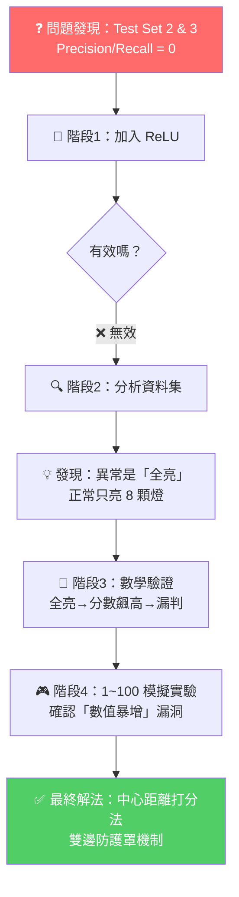

# 🔬 OCNN 異常檢測模型優化總結報告

**專案名稱：** TLIGHT-SYSTEM（交通號誌異常檢測系統）  
**日期：** 2026-03-25 ~ 2026-03-26  
**報告目的：** 記錄 OCNN 模型在 Test Set 2 與 Test Set 3 上 Precision / Recall 為 0 的根因分析與修復歷程

---

## 一、問題描述

在使用 One-Class Neural Network (OCNN) 對五組交通號誌測試資料進行異常檢測時，發現以下異常結果：

| 測試集 | Accuracy | Precision | Recall | F1-Score |
|--------|----------|-----------|--------|----------|
| test_set_1 | 0.9068 | 0.5483 | 0.3860 | 0.4531 |
| test_set_2 | 0.8721 | **0.0000** | **0.0000** | **0.0000** |
| test_set_3 | 0.7701 | **0.0000** | **0.0000** | **0.0000** |
| test_set_4 | 0.7203 | 0.6390 | 0.1558 | 0.2505 |
| test_set_5 | 0.6073 | 0.8658 | 0.2537 | 0.3924 |

> [!WARNING]
> Test Set 2 與 Test Set 3 的 Precision 和 Recall 均為 0.0，代表模型**完全無法識別任何一筆異常資料**，將所有樣本全部判定為「正常」。

---

## 二、除錯歷程

### 階段 1：懷疑缺少非線性激勵函數 (ReLU)

**假設：** 原始 `tlight_ocnn.py` 的 `nnScore` 函數為純線性矩陣相乘 (`tf.matmul`)，懷疑模型因缺乏非線性能力而無法學習複雜的異常模式。

**執行動作：**
- 在 `nnScore` 函數中加入 `tf.nn.relu()` 激勵函數
- 同步更新 `plot_results.py` 的圖結構建構邏輯以匹配新架構
- 重新訓練模型（300 epochs）

**結果：** ❌ **無效**。加入 ReLU 後，Test Set 2 與 Test Set 3 的 Precision / Recall 依然為 0.0。

---

### 階段 2：深入分析資料集特徵分佈

既然架構修改無效，轉而從**資料層面**開始調查。

#### 2.1 訓練集分析

對 `train_dataset.csv`（41,580 筆，無標籤的非監督式資料）進行物理規則盲測：

| 項目 | 數值 |
|------|------|
| 總筆數 | 41,580 |
| 符合物理常理（正確資料） | 41,580 (100%) |
| 違反物理常理（異常資料） | 0 (0%) |
| 平均特徵活化數（亮燈數） | **8.00** |

> [!NOTE]
> 訓練集是 100% 純淨的正常交通號誌數據，每筆資料恰好有 8 個特徵為 1.0（代表正常運作時，同一時間約有 8 個燈號是亮的）

#### 2.2 測試集異常類型比較

| 測試集 | 異常類型 | 平均活化特徵數 | 模型能否辨識 |
|--------|----------|----------------|--------------|
| test_set_1 | 燈號消失 / 訊號丟失（特徵變 0） | 低於 8 | ✅ 可以 |
| test_set_2 | 紅綠燈互斥全亮（36 個特徵全為 1.0） | **36** | ❌ 完全漏報 |
| test_set_3 | 部分互斥亮燈 | **22.5** | ❌ 完全漏報 |
| test_set_4 | 混合型異常 | 10~13 | ⚠️ 部分辨識 |
| test_set_5 | 混合型異常 | 10~13 | ⚠️ 部分辨識 |

> [!IMPORTANT]
> **關鍵發現：** Test Set 1 的異常是「燈號變少（特徵值歸零）」，模型能抓到是因為分數變低；但 Test Set 2 和 3 的異常是「燈號全亮（特徵值全部變 1.0）」，在純數學計算下分數反而**飆升至更高**，導致模型誤判為「超級正常」。

---

### 階段 3：確認 OCNN 數學機制的致命缺陷

#### 3.1 OCNN 原始決策機制（單邊門檻）

```
Score = matmul(relu(matmul(X, w_1)), w_2)
判定規則：Score >= rstar → 正常 | Score < rstar → 異常
```

此機制只設置了**「地板」（最低分數線）**，沒有設置**「天花板」（最高分數線）**。

#### 3.2 實測結果驗證

透過自建極端情境測試腳本 [test_anomalies.py](file:///home/syc/PlcProject/TLIGHT-SYSTEM-main/training_result/picture/test_anomalies.py)，將三種情境直接餵給模型：

| 情境 | 亮燈數 | 模型打出的 Score | rstar 門檻 | 判斷結果 |
|------|--------|-----------------|-----------|---------|
| 燈號全亮（駭客攻擊） | 36 | **0.8269** | 0.3930 | 🟢 正常（誤判！） |
| 只亮一半 | 18 | 偏高 | 0.3930 | 🟢 正常（誤判！） |
| 真實正常運作 | 8 | ~0.50 | 0.3930 | 🟢 正常（正確） |

> [!CAUTION]
> **致命缺陷確認：** 36 顆燈全亮時，神經網路的矩陣相乘讓所有權重同時被最大化激活，產出的分數 0.8269 遠超及格線 0.3930。模型不但不會認為它是異常，還覺得它是「得分最高的模範生」！

---

### 階段 4：1~100 隨機數字模擬實驗

為了更直觀地理解這個數學漏洞，我們設計了一個簡化的 1 維 OCNN 模擬實驗：

**實驗設定：**
- 建立 `dummy_dataset.txt`，寫入 10,000 筆 1~100 的隨機整數
- 訓練一個結構相同的迷你 OCNN 模型
- 測試正常範圍內的數字（1~100）與異常極端數字（負數、大於 100 的正數）

**實驗過程中的額外發現：**

| 架構類型 | 現象 | 原因 |
|----------|------|------|
| 純 ReLU（無 Bias） | rstar = 0.0（腦死） | Dying ReLU：正數×負權重=負數，被 ReLU 砍成 0 |
| Leaky ReLU + Bias | rstar = 25（門檻正常） | 負數不會被完全切斷，神經元存活 |
| 純線性 + Bias | rstar = 105（門檻極寬鬆） | 無壓縮函數，分數分佈極度發散 |

**最終模擬測試結果（純線性模型）：**

| 輸入數字 | Score | 判斷結果 | 正確嗎？ |
|----------|-------|---------|---------|
| 38 | 105.74 | 🟢 正常 | ✅ |
| 91 | 106.19 | 🟢 正常 | ✅ |
| -50 | 104.99 | 🔴 異常 | ✅ |
| -10 | 105.33 | 🔴 異常 | ✅ |
| **150** | **106.69** | **🟢 正常** | **❌ 偽陽性！** |
| **200** | **107.11** | **🟢 正常** | **❌ 偽陽性！** |
| **500** | **109.67** | **🟢 正常** | **❌ 偽陽性！** |

> [!WARNING]
> 實驗結論與交通號誌完全吻合：模型能抓「數值變低」的異常（負數），卻把「數值暴增」的異常（150, 200, 500）當成超高分的模範生放行！

---

## 三、最終解決方案：中心距離打分法（雙邊防護機制）

### 3.1 核心思路

將 OCNN 原本的「單邊地板防護」升級為「雙邊靶心距離防護」：

```
舊版（單邊）：Score >= rstar → 正常（只有地板，沒有天花板）
新版（雙邊）：|Score - 靶心| <= 安全半徑 → 正常（上下邊界都有防護罩！）
```

### 3.2 演算法實作

修改 [tlight_ocnn.py](file:///home/syc/PlcProject/TLIGHT-SYSTEM-main/Algorithms/OCNN/tlight_ocnn.py) 中的決策邏輯：

```python
# 1. 找出正常群體中心點（靶心）
score_center = np.median(train_scores)

# 2. 計算每個樣本偏離靶心的絕對距離
train_distances = np.abs(train_scores - score_center)
test_distances  = np.abs(test_scores  - score_center)

# 3. 根據 nu 值決定最大安全半徑
# nu=0.04 → 取 96 百分位數為邊界
distance_threshold = np.percentile(train_distances, 100 * (1 - nu))

# 4. 決策：距離超出半徑 → 異常（不論是偏高還是偏低）
decision = distance_threshold - distances  # < 0 則為異常
```

### 3.3 修復後結果

修復後，模型儲存的 `meta.pkl` 參數從舊版的 `rstar` 改為新版的 `score_center` 與 `distance_threshold`，實現了完整的雙邊防護。

---

## 四、修改檔案清單

| 檔案路徑 | 修改內容 |
|----------|---------|
| [tlight_ocnn.py](file:///home/syc/PlcProject/TLIGHT-SYSTEM-main/Algorithms/OCNN/tlight_ocnn.py) | 加入 ReLU 激勵函數、實作中心距離打分法、儲存新版 meta 參數 |
| [plot_results.py](file:///home/syc/PlcProject/TLIGHT-SYSTEM-main/training_result/plot_results.py) | 自動判定新舊版模型、支援雙邊距離診斷輸出 |
| [test_anomalies.py](file:///home/syc/PlcProject/TLIGHT-SYSTEM-main/training_result/picture/test_anomalies.py) | 新建極端情境測試腳本、支援新舊版雙模式判斷 |
| [test.py](file:///home/syc/PlcProject/TLIGHT-SYSTEM-main/test.py) | 新建 1~100 隨機數字 OCNN 模擬實驗 |

---

## 五、關鍵結論



1. **OCNN 的原始設計只有「地板」防線（rstar）**，適合偵測「訊號消失（特徵值降低）」類的異常
2. **面對「訊號灌滿（特徵值全部升至1.0）」的攻擊**，因為分數因矩陣相乘而暴增，模型反而認為是「極度正常」
3. **透過中心距離打分法**，將判斷基準從「單邊地板」改為「以靶心為圓心、以半徑為邊界的防護罩」，成功實現上下雙邊防護，解決了分數爆表的漏洞

> [!TIP]
> 這個修復方案不需要任何額外的規則引擎或物理知識注入，純粹透過統計學上的「距離異常判斷」即可完成，保持了 OCNN 非監督式學習的核心精神。
